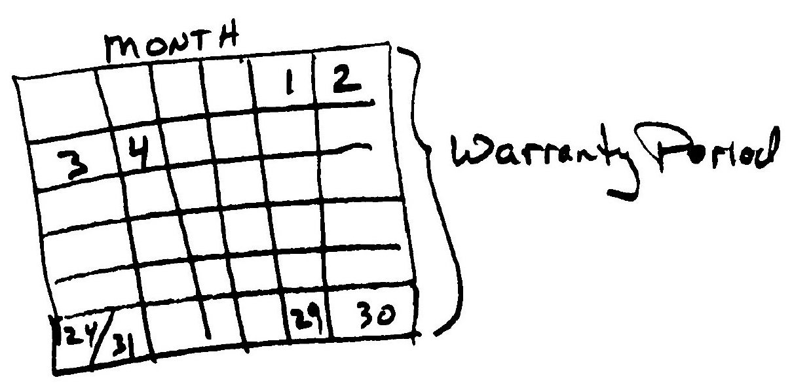

<!-- _class: cover lead -->

# InnerSource Patterns

## 30日の保証期間

Speaker: Yuki Hattor
Pattern Author: Cedric Williams

---

<!--
header: '**InnerSource Patterns**: 30日の保証期間'
paginate: true
class: slides
footer: '[Yuki Hattori (@yuhattor)](https://twitter.com/yuhattor)'
-->

## 概要

"30日の保証期間"プラクティスを利用すれば、自分のチーム以外からのコントリビューションを受け入れる際に、コードを書いていないチームが責任を持つことに対する抵抗を軽減できます。このプラクティスを利用すると、コードを受け取ったチームはコントリビュートしたチームに対してバグフィックスを提供することを承諾することになります。その結果、両チーム間の信頼度が高まり、コントリビューションがより積極的に受け入れられる可能性があります。

---

## 問題

あるチームが、組織全体で使用されるコンポーネントを開発しています。 このチームはコントリビューション(機能への要求を含む) を受け入れることに抵抗したり、完全に拒否したりします。
この振る舞いは進行を妨げたり、エスカレーションによる頻繁な混乱につながります。

---

## 状況

- コントリビューションを受け入れる側のチームによって生み出されたコンポーネントを、コントリビュートした側のチームが使えるかどうか、それは他のチームが受け入れてくれるかに依存してしまいます。
- 受け入れる側のチームが、コントリビュートされたコンポーネントや機能に対するリソース・知識・許可を持っていないか、もしくは(それに加えて) それらのコンポーネントや機能を自分自身で書く意欲がない場合があります。

---

## 組織に働く力学

- コントリビューションを受け入れる際には、過去の不正行為や不信感があり、コードの書き方の知識がないことがあるため、疑念を持つことが自然である。
- 各チームは、自分たちのリーダーが目標を達成することを優先し、そのためには他のチームのコントリビューションを大きく書き換えることがある。
- 自分で書いていないコードに対する責任に抵抗があり、コントリビューションされたものは、高いメンテナンスコストを要する可能性がある。
- 受け手のチームは、コントリビューションを受け入れることで、自分たちのシステムの技術的負債が露呈し、損害を被る恐れがある。
- 受け手のチームは、指導しても納得のいくコードが得られると思わないかもしれず、リスクを測定できないこともある。

---

## 解決策

コントリビュートしたコードが本番稼動した時点から **30日の保証期間** を設けることで、受け入れた側とコントリビュートした側の双方の不安に対処します。この保証期間中、コントリビュートしたチームは受け入れたチームにバグフィックスを提供することに同意します。

なお、保証期間は45日、60日、100日のいずれでもかまいません。この期間は、プロジェクトの制約、プロジェクトのソフトウェアライフサイクル、顧客との約束事項、その他の要因に基づいて変化される可能性があります。

さらに、受け入れ側のチームとコントリビュートする側のチームの期待値を明記した、明確な[コントリビューションのガイドライン](./base-documentation.md)を提供することも役に立ちます。



---

## 結果の状況

- 受け入れ側のチームがコントリビューションを受け入れ、初期適応/修正の作業負担を分担することができます
- 透明性と公平性が高まります
- エスカレーションが重荷になりすぎないようになります

---

## 事例

- これは PayPal で試みられ、成功したことが証明されています。
- GitHub は社内でこのパターンを使っており、6週間という修正された保証タイムラインを使っています。
- Microsoft はこのパターンを原則として推奨しています。チームは自分たちのニーズと自信にマッチするよう具体的な時間目標を設定します。

---

## 同種の例

- 複数の、功績至上主義的に任命された[トラステッドコミッター](./trusted-committer.md)が責任を持つことで、依存するチームの協力をコミュニティ化することで保証する。

---

## InnerSource についてもっと知る

InnerSource Commons: https://innersourcecommons.org
Join our Slack community: https://innersourcecommons.org/slack
InnerSource Patterns: https://patterns.innersourcecommons.org
Twitter: @InnerSourceOrg

日本語 Slack チャンネル: ```#jp-general```
日本語 Twitter: @InnerSourceJP
