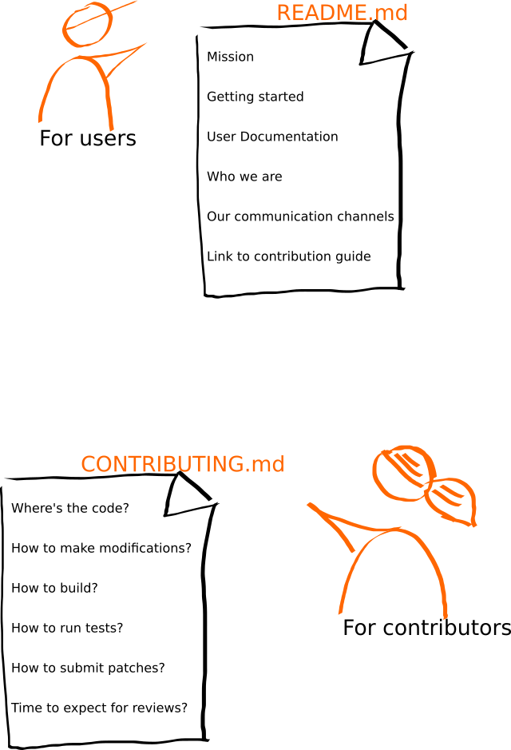

<!-- _class: cover lead -->

# InnerSource Patterns

## スタンダード・ベース・ドキュメンテーション

Speaker: Yuki Hattor
Pattern Author: Isabel Drost-Fromm

---

<!--
header: '**InnerSource Patterns**: スタンダード・ベース・ドキュメンテーション'
paginate: true
class: slides
footer: '[Yuki Hattori (@yuhattor)](https://twitter.com/yuhattor)'
-->

## 概要

インナーソースプロジェクトへの新しいコントリビューターは、誰がプロジェクトを維持し、何に取り組み、どのようにコントリビューションすればよいかを理解するのに苦労しています。`README.md`/`CONTRIBUTING.md` のような標準ファイルでドキュメントを提供することで、新しいコントリビューターのためのセルフサービスなプロセスを可能にし、よくある質問に対する答えを自分自身で見つけることができるようにします。

---

## 問題

あるチームは、新しく始めたプロジェクトや既存のプロジェクトをより広い組織で共有し、それに対するコントリビューションを受けたいと考えています。潜在的なコントリビューターは、しばしば迷ってしまいます。チームの好ましいコミュニケーションチャネルを特定できない。新しい機能が追加されることに意味があるのかどうか、すぐに判断することはできません。また現在、どの同僚が活発にプロジェクトをメンテナンスしているのかを正確に理解するのに苦労しています。

---

## 状況

プロジェクトは、インナーソースプロジェクトとして他の人と共有されることになります。他の人がプロジェクトが何であるか、また、どのようにコントリビュートするかを理解できるようにするために、プロジェクトはいくつかの基本的なレベルのドキュメントを提供する必要があります。これまでのところ、プロジェクトは、すべてのドキュメントまたはユーザーがセルフサービス方式でそれを試してみるだけでなく、コントリビューターが迅速にスピードアップするために必要な項目がいくつか不足しています。

---

## 組織に働く力学

* 最近になってプロジェクトがインナーソースプロジェクトになったことに伴い、セルフサービスの文書が不足している。
* ホストチームには、インナーソースの経験が限られており、どのような情報を含めるべきか、どこで見つけられるようにするべきかがわからない。
* 既存のドキュメントは、技術的な側面に対応しているが、コミュニケーションや計画を促進する情報をカバーしていない。
* チーム内にある暗黙の知識が書き留められていないため、コントリビューターにも不明。
* ドキュメントが不足していることは、セットアップに時間を要することを意味し、ドキュメントを作成するのにも時間がかかる。
* ドキュメントを作成することで、より多くの人がプロジェクトに参加できるようになり、プロジェクトはよりスムーズに進む。

<!-- 
* プロジェクトがインナーソースのプロジェクトになったのは、つい最近のことです。以前は、ユーザーは社内のみ、または個人的な対面セッションでオンボーディングされていました。同様に、プロジェクトで働く人々は、コントリビューターやリモートコントリビューターの数の増加に伴いスケールしない個人的なオンボーディングセッションを通過しました。その結果、セルフサービスの文書が不足しています。
* プロジェクトは、インナーソースプロジェクトとして新しく作成されました。しかし、ホストチームには、十分なインナーソースの経験がありません。その結果、彼らはどのような情報についてのガイダンスをドキュメントに含める必要があるのか、他の人がどこでそれを見つけることができるようにすべきか、どのような人に対してそのドキュメントを提供すべきなのかがわかりません。
* プロジェクトは、つい最近インナーソースプロジェクトになりました。ホストチームは、インナーソースに関して限られた経験を持っています。その結果として既存のドキュメントは、技術的な側面の多くに対応していますが、コミュニケーション、調整、透明性の高い計画を促進するために必要な情報をカバーしていません。
* プロジェクトは、ごく最近インナーソースのプロジェクトになりました。その結果、チーム内に存在する多くの暗黙の知識が書き留められることはなく、コントリビューターにとっても明らかではありません。
* ドキュメントの欠如は、潜在的なコントリビューターがセットアップをして作業を開始するのに長い時間がかかることにつながります。ドキュメントを作成する(そしてそれを最新に保つ)には、時間的な投資が必要です。たとえホストチームがドキュメントの欠如に関してコントリビューターに頼ったとしても、それらのコントリビューションはレビューする時間を必要とします。
* プロジェクト・メンバーは、使い始めの質問に答えるために多くの時間を費やしています。しかし、サポートに関する質問の包括的なデータベースを維持することは、多くの時間と労力を必要とします。
* ソースコードのフォーマットやソフトウェアのパターンについて、組織内の異なるチームが異なる基準を持っています。その結果、コントリビューションはしばしば、大部分または全体が書き直されてしまうこともあります。そのすべてを標準化し、その標準を強制するには、多くの時間と労力が必要になるケースがあります。
* このように、説明と書き直しを繰り返す作業は、インナーソースアプローチの有用性を低下させます。
* 余分な仕事と書き直しのための遅延による頻繁なエスカレーションは、ビッグチーズ問題(*)に発展します。
  (*ビッグチーズ問題について-和: ビッグチーズとは「お偉いさん」のことを指します。現場がわからない上の人同士でコミュニケーションをとることによる問題をさします。例として、政治的にコードベースへの統合が実施されることで、例えそのコードが要件を満たしていなくても統合しなければいけない状況が起こり、コントリビューションを受け入れる側が多くの作業をかかえることになります)

-->

---

## ソリューション

新しいコントリビューターのために、より明確なドキュメント作成の作業に取り組む。このドキュメントを作成する際の目標は、よくある質問に標準的なドキュメント形式で回答することで、可能な限りセルフサービスのプロセスを開始できるようにすることです。

---

### README.md

まだ存在しない場合は、あなたのプロジェクトの `README.md` を作成してください。それには以下の内容が含まれていなければなりません。

* [プロジェクトのミッション](https://producingoss.com/en/producingoss.html#mission-statement) 
* プロジェクトで実働をするユーザーに向けた "Getting Started" セクション。
* プロジェクトユーザーのための詳細なドキュメント - またはそれへのリンク
* プロジェクトを修正するために必要なドキュメント - またはそれへのリンク
* プロジェクトにコントリビュートする方法に関するドキュメント - またはそれへのリンク
* プロジェクトがどのようなアクセス可能なパブリックもしくはアーカイブのコミュニケーションチャネルを用いているかを説明する "Getting involved" セクション。
* プロジェクトを支える [トラステッドコミッター](./trusted-committer.md)が誰であるかを説明する "Who we are" のセクション。
* プロジェクトが貢献者を信頼されるコミッターにするための基準の説明。
* コントリビューターがそのプロジェクトにおけるトラステッドコミッターになるための基準及び、そのパスが存在するならばそのパス

<!--
* [プロジェクトのミッション](https://producingoss.com/en/producingoss.html#mission-statement) できるだけ簡潔な形式にしてください。これは、プロジェクトの目的が何であるかに答え、提案された機能がプロジェクトの範囲内にあるかどうかを、コントリビューターが最初に推測できるようにする必要があります。
* プロジェクトで実働をするユーザーに向けた "Getting Started" セクション。プロジェクトの成果物をどのようにセットアップし、統合するかを説明し、初めてのユーザーのためのファーストステップに関する説明も必要です。
* プロジェクトユーザーのための詳細なドキュメント - またはそれへのリンク
* プロジェクトを修正するために必要なドキュメント - またはそれへのリンク
* プロジェクトにコントリビュートする方法に関するドキュメント - またはそれへのリンク
* プロジェクトがどのようなアクセス可能なパブリックもしくはアーカイブのコミュニケーションチャネルを用いているかを説明する "Getting involved" セクション。このリンクには、プロジェクトのイシュー・トラッカーへのリンクだけでなく、さらなるディスカッションメディアへのリンクも含めるべきです。
* プロジェクトを支える [トラステッドコミッター](./trusted-committer.md)が誰であるかを説明する "Who we are" のセクション。これらの人々と個人的に連絡を取る代わりに、上記の公開コミュニケーションチャンネルを使用して連絡を取るべきであるという説明も必要です。
* プロジェクトが貢献者を信頼されるコミッターにするための基準（もしそのような道があるならば）の説明です。
* コントリビューターがそのプロジェクトにおけるトラステッドコミッターになるための基準及び、そのパスが存在するならばそのパス

-->

---

### CONTRIBUTING.md

コントリビューションを行うための手順の説明が複雑すぎる場合は、`CONTRIBUTING.md` というドキュメントを別に作成します。この文書では、コントリビューターが過去によく聞かれた質問に答えるようにします。前もって包括的なドキュメントを提供する必要はありません。むしろ、コントリビューターが必要としていることが証明された情報を共有しましょう。おそらく、以下のトピックのうちの1つ以上に触れることになるでしょう。

* プロジェクトのソースコードをバージョン管理からチェックアウトする方法
* プロジェクトに変更を加える方法 (コーディングガイドラインに関する情報を含む可能性があります)
* プロジェクトをビルドする方法
* 上記の修正が新しいバグを引き起こしていないことを確認するためのテストの実行方法
* プロジェクトにあなたの修正をサブミットする方法
* 修正が行われた場合、変更が取り込まれるまでに必要な所要時間に関する情報

---

### CONTRIBUTING.md



様々なオープンソースプロジェクトにおいて、README.md の書き方や、CONTRIBUTING.md ファイルにどのような情報を含めるべきかについての良い例がたくさんあります

* How to write a readme that rocks
* Open Source Guide from GitHub
* Producing Open Source
  * Producing Open Source の Getting Started chapter には、ホストチームのメンバー、ユーザー、コントリビューターが必要とするもののかなり広範なリストがあります

このパターンには、すぐに始められるように、2つの非常に基本的なテンプレートが付属しています
* README-template.md
* CONTRIBUTING-template.md

<!--
様々なオープンソースプロジェクトにおいて、README.md の書き方や、CONTRIBUTING.md ファイルにどのような情報を含めるべきかについての良い例がたくさんあります
いくつかのページ (例: How to write a readme that rocks, Open Source Guide from GitHub, Producing Open Source) には、貴重な情報が掲載されています
Producing Open Source の Getting Started chapter には、ホストチームのメンバー、ユーザー、コントリビューターが必要とするもののかなり広範なリストがあります
インナーソースのプロジェクトは、おそらく最初からこれらの側面のすべてをカバーする必要はありませんが、リスト自体は README.md がカバーできるものを想起するために有効です
このパターンには、すぐに始められるように、2つの非常に基本的なテンプレートが付属しています
README-template.md
CONTRIBUTING-template.md
-->

---

## 結果の状況

* コントリビューターがスピードを上げるまでの時間が大幅に短縮されます
* [トラステッドコミッター](./trusted-committer.md) が初歩の質問に答える時間が大幅に短縮され、他の作業に時間を割くことができるようになります
* 誤った理解や、同じ方向を向いていないことによるエスカレーションが大幅に削減されます

---

## 事例

* Europace AG - こちらのブログをご覧ください [InnerSource: Adding base documentation](https://tech.europace.de/post/innersource-base-documentation/)
* Paypal Inc.

---

## リファレンス

* [README-template.md](../templates/README-template.md) and
* [CONTRIBUTING-template.md](../templates/CONTRIBUTING-template.md)

---

## InnerSource についてもっと知る

InnerSource Patterns: https://patterns.innersourcecommons.org
Slack Community: https://innersourcecommons.org/slack
Twitter: @InnerSourceOrg

日本語 Slack チャンネル: ```#jp-general```
日本語 Twitter: @InnerSourceJP
